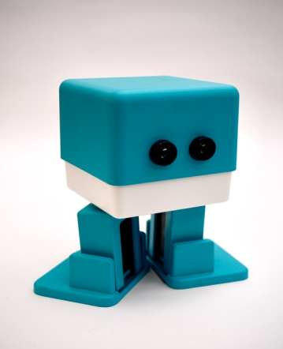

   #Гайд и правила проекта
##Как работаем с картинками
+ Исходники картинок распологаем по пути `app/images/`
+ Далее когда распологаем их в html коде дописываем в пути `dest` :`app/images/dest`
+ Там же будут распологаться и картинки в формате `.webp`
+ Кроме картинок формата `.svg`
Пример:
Исходник картинки лежит по адресу `images/dest/bot.png`

`<picture>` `
    <source srcset="app/images/dest/bot.png" type="image/webp">` `
    ` `
</picture>`
Тоесть другими словами, мы загружаем одну картику, а на выходе получаем две, которые лежат в другой папке
***
##Как развернуть проект
1. установим пакеты `cd offical-site-leocrm && npm i`
2. Запустим сборщик проекта `cd offical-site-leocrm && gulp`
***
##Как сбилдить проект
+ Билдим `cd offical-site-leocrm && gulp build`
Билд проекта находится в папке `dist`
##Правила разработки
+ HTML файл каждой новой страницы распологается в корне проекта
+ Каждой странице соответствует отдельный `.scss` файл, который распологается: 
+ `app/scss/имя страницы`
+ Цвета используем только из переменных `app/scss/variables/variables.scss`
+ Проект имеет сброс стилей css `app/reset_css/reset.scss/`
+ Библиотеки подключаем через `gulpfile.js`
+ Классы именуем согласно `BEM`
+ Используя препроцессор scss мы не используем его возможность глубоких вложенностей, 
максимум это вложенность типа:  
   `.main-page-btn { ` `
   border: 1px solid transparent;` `
   &:hover {` `
   border: 1px solid var(--primary-2);` `
   }` 
  или  
  ` .main-page-btn {` `
  &.registration {` `
  margin: 0;` `
  }` `
  }`
+ Медиазапросы пишем в конкретном файле соответствующем странице, снизу!
+ файлы называем через тире `-`
+ папки называем через нижнее подчеркивание `_`
+ не удаляем чужие комментарии и задокументированные  
куски кода
+ не пишем стили в html-коде 
+ используем для разработки дефолтный контейнер класс `.container`  
он имеет стили для мобильной версии
